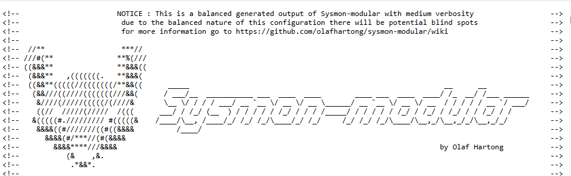
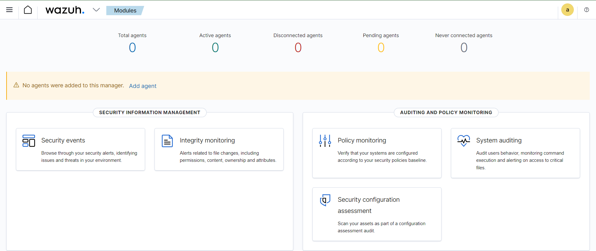
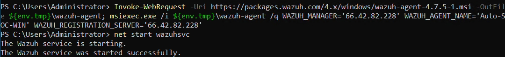
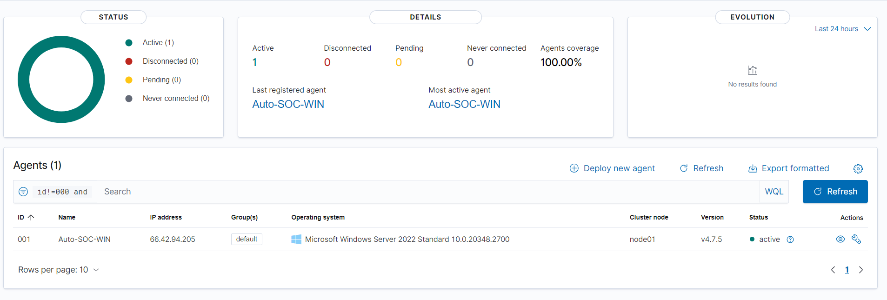
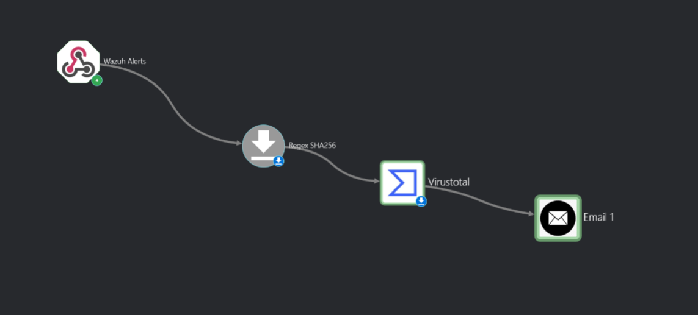
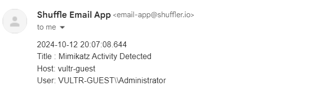

# SOC-Automation-Lab

## Objective

The SOC Automation Lab project aimed to establish a controlled environment for simulating and detecting cyber attacks and subsequently use this environment for experimentation and practice with both Security Information and Event Management (SIEM) and Security Orchestration, Automation, and Response (SOAR) technologies. The primary focus was to deploy and configure a basic SIEM system, along with a few other hosts for that SIEM to monitor. This SIEM was then used to ingest and analyze logs and generate test telemetry to mimic real-world attack scenarios. Finally, the alert data generated by the SIEM was fed into the Shuffle framework in order to produce an automated response (in this case, Indicator of Compromise (IoC) enrichment via VirusTotal, and the sending of an email). This hands-on experience was designed to deepen understanding of both SIEM and SOAR technologies, attack patterns, and defensive strategies. I would like to especially thank and acknowledge the MyDFIR YouTube channel for providing a detailed tutorial on setting up and configuring this project. 

### Skills Learned

- Advanced understanding of SIEM concepts and their practical application.
- Increased understanding of SOAR conecpts and their practical application.
- Ability to generate and recognize attack signatures and patterns.
- Enhanced knowledge of network protocols and security vulnerabilities.
- Development of critical thinking and problem-solving skills in cybersecurity.

### Tools Used

- Security Information and Event Management (SIEM) system for log ingestion and analysis (Wazuh).
- Security Orchestration, Automation, and Response (SOAR) system for automated response to security alerts generated by the SIEM (Shuffle Automation).
- Telemetry generation tools to create realistic network traffic and attack scenarios.

## Steps

To elaborate on the outline of the lab provided above, the overall goal of this project was to set-up a basic SOC environment using Wazuh and then configure this system to detect Mimikatz activity via a custom alert. Once this was done, Shuffle Automation, an open-source SOAR platform, was used to enrich the IoC data generated by Wazuh, and then subsequently send an email to a hypothetical SOC analyst, alerting them that a detection rule had been triggered. Implementing this project required several different machines, most of which were hosted in the cloud:  the SOC analyst machine (a physical system in the form of my personal laptop), a Windows 10 host (Vultr Cloud, the victim machine), and a Ubuntu 22.04 LTS servers (Vultr Cloud, the Wazuh host). Both the Windows and Ubuntu machines were hosted in the cloud using Vultr as the provider. A network diagram illustrating this setup is provided immediately below.

  

*Ref 1: Network Diagram*

### Deploying the Windows 10 Client and Installing Sysmon
The first step in the lab consisted of deploying the Windows 10 client which functioned as the victim in our project scenario. To accomplish this, we navigated to the main Vultr display panel and deployed a new instance, specifying Windows 10 as the operating system and allocating an appropriate amount of RAM, storage, and CPU cores to the instance. We also created a Firewall policy that blocks all traffic from all IP addresses except for the SOC analyst laptop, which is given access to all TCP ports (1-65535), and then added the new Windows host to this policy. This is a critical step, as otherwise our host will be exposed to the entire internet. In other labs I have conducted, instances which were exposed in this way were almost immediately discovered by bots (in an under an hour in several cases), and subsequently became the victim of a large number of brute force attacks (the 30 Day Challenge/ELK stack project, which is under development, provides a more detailed account of my encounter with this phenomenon). 

  
  
  *Ref. 2: A screenshot of the single rule added to the Auto-SOC-Default Firewall Group, the IP address of the SOC Analyst laptop has been redacted for the privacy of the author*

Once the Windows host was up and running, we used the Windows Remote Desktop Protocol (RDP) to connect to it via our SOC Analyst laptop in order to install Sysmon. Sysmon is a Windows service used to collect detailed information on process creation, network connections, and even file modification. This application adds a lot of detail and context to Windows system logs that is otherwise lost, and is thus highly useful for anyone looking to find evil in a Windows system. For this project, Sysmon was used to detect the actions of a simulated hack (consisting of the creation of a Mimikatz process), and it will accordingly be Sysmon data that will be ingested by our SIEM.

To install the applicaiton, we navigated to the official download page on Microsoft's website:

    https://learn.microsoft.com/en-us/sysinternals/downloads/sysmon

and followed the usual procedure for downloading something from the internet. Once the download was finished, a folder called Sysmon.zip was waiting for us in the Downloads folder. This zipped folder had to be be extracted, and the Downloads folder was once again used as the destination. As outlined in the Sysmon documentation (referenced below), to install Sysmon once the file has been extracted, one needs to run the executable included in the download with an optional configuration file. For this lab, the popular sysmon-modular configuration was used, and can be found at the following address. 

    https://github.com/olafhartong/sysmon-modular/blob/master/sysmonconfig.xml

Thus, this file was accessed via the link above, and saved into the Sysmon folder that was just extracted.

  
  
  *Ref. 3: The beginning of the Sysmon configuration file utilized in this project*

Once this was accomplished, we opened a PowerShell session as an administrator and ran the installation executable. To do so, we first navigated to the appropriate directory,

    cd C:\Users\Administrator\Downloads\Sysmon

and then ran the executable, using the -i option to specify the configuration file:

    .\Sysmon64 -i sysmonconfig.xml

After the executable was finished running, we checked the Windows services list to ensure that Sysmon has indeed been succesfully installed and is present on the machine. This was done by navigating to the Services app (which can be found by simply searching for 'services' in the Windows start menu), then scrolling to the S section of the Services window (the services are ordered alphabetically) and searching for Sysmon64 on the list. According to the documentation, Windows services are verily similar to Linux services with which the author is much more familiar, and although they can't be controled via Systemd, they function in an analogous way. For example, they can be configured to start on at boot-time and run in the background, not directly interfering with the user, just like Linux services. But, turning our focus back on the lab, our Sysmon install was successful and we were able to move onto the next step, creating the Wazuh server.

  
  
  *Ref. 4: A snapshot demonstrating the location of the Sysmon64 service in the Windows services list*

### Deploying the Wazuh Server
The next step in our lab was deploying the Wazuh server and installing the Wazuh server on this newly deployed instance. Wazuh itself can function both as an Extended Detection and Response (XDR) platform and a SIEM system. It works by installing an agent on machine the administrator would like to monitor, and this agent ingests log data that it forwards to the centralized Wazuh server. Then, the Wazuh server processes the data, generates alerts, etc.
In this case, our Wazuh server was located in the cloud, hosted by Vultr, instead of a VM on our local machine. So, to deploy the machine, we logged onto to our Vultr account through their web portal and then deployed a new server, named Auto-SOC-Wazuh, using Ubuntu 22.04 LTS for the operating system. In terms of system resources, this system will be somewhat beefy, although it is by no means a monster, weighing in at 8GB of RAM and ***GB of storage. Once the server was ready to go, we added it into the Auto-SOC-Defualt firewall created above to prevent brute force attacks. However, this firewall needed to be modified in order to allow traffic between the Windows host and the Wazuh server. Accordingly, a rule was added to allow all traffic on TCP ports 1-65535 for traffic whose source/desitnation was either the Windows host or the Ubuntu machine.

As soon as server finished booting up, we ssh-ed into its root account via a PowerShell session on the SOC Analyst Laptop, inputting credentials as necessary so we could begin the Wazuh install. For this project, Wazuh was installed using an automated script, which can be found in the Wazuh documentation and may be executed with the following:
  
    curl -sO https://packages.wazuh.com/4.9/wazuh-install.sh && bash wazuh-install.sh -a

It would no doubt be beneficial to practice installing the application by hand. This however, must await a future date when the lab, or a similar lab that also utilizes Wazuh, will be redone using only manual installation techniques. In any case, as the script ran, it output a message declaring that ports 1514, 1515, and 443 must all be open on the Wazuh server. Accordingly, we allowed these ports through the firewall on our machine via ufw:

    ufw allow 1515
    ufw allow 1514
    ufw allow 443
    
after the script was finished running. After the Wazuh isntall script ran successfully, we were presented with a message that displayed the default credentials that were to be used to login to the Wazuh web console:

  

  *Ref. 6: A screenshot of the Wazuh credentials and installation completion message. The server has been dismantled so these credentials no longer correspond to a live instance*

This completed the Wazuh installation process. 

### Configuring Wazuh
In this step, we installed a Wazuh agent on our Windows machine. This agent is designed to ingest all sorts of log data generated by the Windows machine, and then forward this data to the Wazuh server. However, by default, it is not configured to ingest Sysmon data, so it was also necessary to change the configuration of the agent to rectify this. To begin the installation process, we first has to access the Wazuh application via web browser, not the Windows host. Thus, we navigated to the public IP address of the Wazuh server:

    https://66.42.82.228
    
(Wazuh defaults to port 443 so we didn't need to specify the port in our address). We were thus presented with the Wazuh login screen. The login credentials for this application were outputted in the previous stage of the lab, and can actually be viewed in a screenshot above (note, however, that these instances have been dismantled). After inputting the credentials outputted in the installation process, we naturally gained access to the Wazuh console.  

  

  *Ref. 7: A screenshot of the Wazuh console page upon initial login*

There was a convenient link to add a new agent prominently displayed on the console, and we simply clicked this link to begin the process of installing the Wazuh agent on our Windows machine. 

Once the link was clicked, we had to specify the operating system of the host on which the agent will be installed, the address the agent will use to communicate with the central Wazuh server (the public IP address of our Wazuh server in this case), as well as a few optional settings such as the agent name and a group. We skpped the group setting, but input the agent name as Auto-SOC-WIN. After filling in the necessary information, a PowerShell command was provided that, when executed on a Windows host, can be used to download the agent. Thus, we RDP-ed into the Windows machine and ran the command. 

  

  *Ref. 8: The PowerShell command which downloads the Wazuh agent onto the Windows host*

After the command finished executing, we started the Wazuh service on our Windows host with the command below:

    net start wazuhsvc

hoping the agent was able to orchestrate a connection with the Wazuh server. Luckily, we did not need to rely on hope alone, as we were able to verify a connection by checking back into the Wazuh console to see if the agent had connected successfully, and in our case, the connection was indeed successful. 

  

  *Ref. 9: The Wazuh console after our Windows agent has successfully connected*

Now that we had a working Wazuh agent, we needed to create a Wazuh rule for detecting the malicious executable Mimikatz. 

### Downloading Mimikatz and Creating a Rule to Detect It
As alluded to in the conluding lines of the last session, it was now finally time to simulate some malicious activity on our Windows host and then detect this technological malfeasance through our Wazuh SIEM. First, we loaded up Mimikatz on the Windows target, and once this was done, we proceeded to create a rule to detect it. 

To download Mimikatz, we first needed to add an exclusion to our Windows Defender configuration. An exlusion instructs Defender to not scan a particular folder, file, file type, or process, and we needed to add such an exlusion to the folder into which we intend to download Mimikatz, otherwise Defender would have removed it from our machine immediately upon install (this is usually a good thing, as Mimikatz is a very well known malicious file used to pillage the Windows LSASS system for user credentials!). To add the exclusion, one must again open the Start Menu, and search for Windows Security or just Security and select the Windows Security result. From here, one must select the 'Virus & threat protection' option, and then the 'Manage settings' link under 'Virus & threat protection settings'. Then, one needs to scroll all the way to the bottom of the page and click 'Add or remove an exclusion' under Exlusions, then 'Yes' to allow Windows Security to make changes to the device. Finally, one selects the 'Add an exclusion+' button, select Folder from the drop-down menu, and then input the file-path for Mimikatz. For this scenario, I executed the process just described to add an exclusion to the Downloads folder, which would be highly unwise if this were a production environment. 

  

  *Ref. 10: An image showing how an exclusion is displayed in the exlusions menu after it has been successfully added*

Now that Windows Defender was configured to not look askance at our file, we were able to download it.  The executable file for Mimikatz can be found at the following Github repository:

    https://github.com/gentilkiwi/mimikatz/releases
    
In our case, we downloaded the .zip folder onto the Windows machine through a web browser. Note, quite a number of browsers will attempt to block this download, as Mimikatz is quite a notorious piece of malware. It may therefore be necessary to configure your browser to allow the download. For example, in Google Chromse, one needs to navigate to Browser Settings, Security, and then select the No Protection option. 

  

  *Ref. 11: Displays the Turn Off Safe Browsing selection in Google Chrome*

Once tthe download was finished, we extracted the mimikatz_trunk.zip folder, and then navigated to the  

At this point, it was time to turn our attention back to the Wazuh agent, with a view towards configuring the agent to ingest Sysmon logs. To do this, we modified the agent's configuration file on the Windows machine. The configuration file for the agent is located at the following path:

    C:\Program Files (x86)\ossec-agent\ossec.conf

It's best to copy this file as a backup just in case a mistake is made and the agent breaks. On Windows machines, this is especially straighforward, and can be accomplished by simply right-clicking on the file, selecting copy, and then pasting the copied file in the same location as the original. In our case, we copied the filed with no issue, renaming it to reflect that it was a backup. Next, we opened the file using Notepad. According to the Wazuh documentation (contained in the references section of this project, located below), we needed to add the following lines of code in order for our agent to begin collecting logs from Sysmon:

  

  *Ref. 12: A snapshot of the lines added to the Wazuh agent configuration file to enable Sysmon ingestion*

Once we added these lines to the file, we saved it and then restarted the Sysmon service so it could read in the changes we just made to its configuration. This can be done in a few different ways, the most straightforward of which is to simply execute the below command in a PowerShell session.

    Restart-Service -Name wazuh

If, however, GUIs are more your style, this can also be done via the Services applicaiton on the Windows machine. One simply needs to search for 'services' in the Start Menu, select the first option, and then find the Wazuh service within the services list and select it. There should then be a restart option to select in the righthand side of the window. 

  

  *Ref. 13: An image portraying the Wazuh service from within the Windows Services application which portrays the Restart option*

At this stage in the process, we had a working Mimikatz executable on the Windows host along with a working Wazuh agent configured to ingest Sysmon logs. It was now time to create an alert to detect Mimikatz on our Wazuh server. 

### Creating a Wazuh Alert to Detect Mimikatz
By default, Wazuh only logs an event when a rule or alert was triggered. This means that, even if we were to run Mimikatz right after we installed it, Wazuh would not pick up this type of activity as there is no rule or alert defined to detect it. For our lab, we modified this to make Wazuh log everything, which will allow us to look at the data that is logged when we run Mimikatz and create an alert or rule based on that data. To change the configuration accordingly, we first ssh-ed into the Ubuntu server that hosted Wazuh. Then, we made a copy of the configuration file in our home directory, which is located at

    /var/ossec/etc/ossec.conf

via the classic command cp, 

    cp /var/ossec/etc/osssec.conf ~/ossec-backup.conf

The fields that needed to be modified were the <logall> and <logall_json> within the <global> tag. Both needed to be changed to yes, instead of the default, which is no. Thus, we changed the fields accordingly and then restarted the Wazuh service via systemctl. 

  

  *Ref. 14: This image displays the area of the Wazuh configuration file that was modified to configure archiving*

Again, according to the doucmentation, in order for these alerts to be viewable in the Wazuh web app/dashboard, one also needs to change the filebeat configuration. Thus, we also modified this configuration file. This time, there was only a single variable that needed to be altered. By default, the file reads 'archives: enabled: False', and False needed to be changed to True. 

  

  *Ref. 15: This image displays the area of the Filebeat configuration file that was modified to configure archiving*

At this stage of the lab, Wazuh was archiving everything and filebeat was configured to send these labs to the web application. It was now time to see if we could generate some data via Mimikatz and see if we could use the data generated to create a detection policy. 

First of all, we returned to the Wazuh dashboard to create our rule. Once we logged in successfully, we navigated to the menu whichc consists of three horizontal bars in the top left corner (hereafter referred to as the 3-bar menu) which functions as the main means of navigating around the various pages found in the applicaiton. Once we clicked the 3-bar menu, we then selected the Stack Management page, followed by the Index Pattern option. In Wazuh, and index is a collection of documents that relate to one another, and these indexes are essentially used to organize the data in Wazuh to make search and retrieval more efficient and intuitive. In our case, we were interested in the 
    
    wazuh-archives-* index 
    
This is because the archives index contains all of the data sent to Wazuh, whereas the other indexes contain alerts or statistical information, and will therefore say nothing about our Mimikatz activity. Unfortunately, the archives index did not exist yet at this point, and so we were forced to  create it. To do this, we selected the Create Index button in the top right corner, and then inputted the name above. Wazuh recognized this name and the creation was successful. 

With the work we had done so far, we should have been able to see Mimikatz activity in the Wazuh dashboard if any had been generated. We decided to test this, and so returned to our RDP connection to the Windows host, and ran Mimikatz via PowerShell:

    .\mimikatz.exe

We then returned to the Wazuh Discover dashboard to search for the Mimikatz event just generated, and lo and behold, there it was!

Both of these data fields By examining the event data fields, we compiled a list of suitable characteristics by which we might identify further Mimikatz activity in the future with an alert. Among these were the 

    originalFileName
    
Using this field to identify Mimikatz activity will be advantageous, as it allows the alert to be triggered even if the attacker changes the file name after install. On the contrary, if we were to use a field like 

    data.win.eventdata.image

which stores the current path (including the file name) of the executable, an attacker could bypass our alert by simply changing the file name. 

After we had examined the event data and had a few data fields to use as the basis of our alert, we returned to the Wazuh dashboard to create the rule itself. To create our rule, we took inspiration from some similar rules that exist by default in Wazuh. More specifically, we were looking for a template rule that detected an event that associated with Sysmon Event ID 1, which is a process creation event. To search through the extant Wazuh rules, one navigates to the Home menu, then selects Management, followed by Rules, and finally Manage Rule Files. Once there, the next step is to search for sysmon, and then one will be presented with several results, of which, the file called

    0800_sysmon_id_1.xml

was used as the template for our scenario. 

  

  *Ref. 16: The results of the 'sysmon' search from the Manage Rule Files page*

A sample rule (rule 92000, to be precise) was copied from this file, and then pasted into the 

    local_rules.xml

file and altered according to the purposes of the lab. The rule ID was changed from 92000 to 100002 (all custom rules must start form 100000, and 100001 already existed), the level was changed to 15 to reflect the extreme risk a Mimikatz instance represents to the security of a system, and the field name was changed to the win.eventdata.originalFileName identified above. In addition, the regex pattern was altered to fit the original file name of the Mimikatz executable after install, mimikatz.exe, and the options tag was removed. Finally, the description was changed to 'Mimikatz Usage Detected', and the ID tag was change to T1003 which is the MITRE technique code for credential dumping. The end result of this process was the following block of XML code within the local_rules.xml file. 

  

  *Ref. 17: The results of the 'sysmon' search from the Manage Rule Files page*

After making these changes, the file was saved, and then the Wazuh panel prompted us to perform a restart. We confirmed this, and allowed the system to reload. With this last step behind us, we had successfully created the rule to detect Mimikatz, and it was now time test that rule and examine the alerts generated. 

### Testing the Mimikatz Detection Alert
This process was fairly straight forward. We first navigated back into the RDP session maintained between the Windows and SOC Analyst hosts, and then renamed the Mimikatz executable (that way, we can determine whether the alert will still trigger if we have some light evasion activity on the part of the attacker). In our case, we renamed the file to 'totallynormalfile'.

  

  *Ref. 18: An image displaying the renamed Mimikatz file*

After we renamed the file, we ran it via PowerShell using the new executable name:

    .\totallynormalfile.exe

  

  *Ref. 19: An image displaying the output of the Mimikatz executable*

At this stage, our alert should have been triggered. To check this, we navigated back to the Security Events panel of the Wazuh dashboard, and were met with a very encouraging result: our alert had been triggered and the Mimikatz executable had been discovered!

  

  *Ref. 20: The alert generated by our newly created rule after running the Mimikatz executable*

### Implementing a SOAR with Shuffle Automation
We now had a working Wazuh alert to detect Mimikatz activity. It was time to expand the capabilities of our SIEM by implementing a SOAR system to enrich the data generated by our alert through VirusTotal, and then send an automated email to our SOC analyst to alert them about the suspicious behavior detected. Both of these events were orchestrated via the open source SOAR platform Shuffle Automation. As a side note, although both of these examples are pretty simple, they went a long way towards deepening our understanding of the potential inherent in SOAR technology. Python, Bash, and other Scripts could be easily incorporated, along with a laundry list of other applications. It will no doubt be an exciting future project to build on the simple implementation which was illustrated here and create a more elaborate response system. 

In any event, we began by creating a Shuffle Automation account. After this, we created a new Workflow. In Shuffle, Workflows are an abstraction used to refer to some arbitrary automation process. So, to take the present lab as example, the process of ingesting data into the Shuffle platform via Wazuh, then sending that data to be enriched through the VirusTotal API, and finally generating an email to send to the SOC Analyst would be referred to as a Workflow within the Shuffle environment. Consequently, the first step in using Shuffle to automate processes is to create a new Workflow, and that was exactly what I did. 

  

  *Ref. 21: Creating a new Shuffle Automation Workflow*

After creating the Workflow, we needed a way to ingest or receive the data from Wazuh into the Shuffle application to begin the automation process. To accomplish this, a Shuffle webhook was used. As per the Shuffle documentation, a Webhook is a type of trigger (a trigger is some an event which sets off the execution of a Workflow without user intervention) that is able to take in data via an HTTP request, hence the name Webhook. 

After adding the webhook, we had a way to feed data into our Workflow. Now it was time to use that data. As explained above, the first action taken by the workflow would be to enrich the indicators of compromise (IoCs) contained within the data by generating a hash report through the VirusTotal platform. Thus, we added the VirusTotal app to our Workflow, changing its name from the default to a simple VirusTotal. We then changed the default action associated with the app from 'Get an ip address report' (presumably this fetched a report the reputability of a particular IP address) to 'Get a hash report', which fetches a VirusTotal report for a specific file hash. 

Once this was accomplished, we configured our VirusTotal node to authenticate to our VirusTotal account by copying our VirusTotal API key into the authentication section of the node. After that, we filled in the hash field by clicking the circle-plus icon and then clicking Execution Argument, followed by selecting Hashes to autopopulate this field with the hash generated by the previous node. This completes the VirusTotal node, and we simply save the workflow and rerun it to see its results.

  

  *Ref. 22: This image displays the data returned from VirusTotal in its hash report*

### Sending Emails with Shuffle
The final phase of the lab had arrived, it was time to automatically generate and send an email to the SOC Analyst using Shuffle. This step would end up being more straightforward than I had anticpated, and consisted, first of all, of adding an Email node to our existing Shuffle workflow. 

  

  *Ref. 23: An image of the final workflow, including the email node*

Once this was accomplished, I added my work email address into Email field of the newly created node, followed by the Subject, and then included various fields from the alert data to generate the body of the email.

To test our process, we entered the RDP session with the Windows victim once more, and then ran the Mimikatz executable, then checked our email address. Sure enough, we had an email which gave details about the event waiting for us. Our work was thus complete!

  

  *Ref. 24: The content of the automated emial sent by our Shuffle workflow*

## Concluding Insights and Observations
The main technical objectives covered by this lab and the skills they develop are outlined above, in the intorduction and Objective sections. Here, I will explore what I felt was the most valuable aspect of completing this lab, and how it inspired me to further explore and develop. 

This lab was highly informative for a variety of reasons, but of course, as with most things in life, what I received from it was not what I was expecting. The first take-away was an amazing appreciation for the possibilities of SOAR technology. Although the automation that I established in the lab was pretty simple, it opened my eyes to just how much might be accomplished using this model. The Shuffle platform allows for the use of Python, Bash, and PowerShell scripts, automated email, and supports an extremely large number of third-party apps which can all be used to provide automated responses to security alerts. This is pretty incredible. When one begins contemplating all that might be accomplished with such a mixture of tools, it is hard not to get excited about experimenting further with the technology. To that end, I would like to build upon the foundational SOAR concepts learned in this project in a future lab.

Now, to the second take-away. The details of implementing a SIEM and a SOAR will vary from implementation to implementation. Elasticsearch is slightly different from Wazuh, which in turn varies in its particulars from Microsoft Sentinal and Splunk (although, to be honest, Elasticsearch and Wazuh were rather similar in my experimentations with them, and I do not yet have any familiarity with the other tools mentioned here). These implementation details are probably the least interesting thing about this lab, although they are definitely important and it was enjoyable getting some hands on experience with them. Instead, what was quite exciting, were the insights it gave me into the process of alert detection and response. Before this lab, I had conceived of the alert generation process as being quite static, working analogously to some antivirus systems in which threat signatures are compared against a large database of known exploits. In such a scenario, it seems that the analyst's only duty would be to sit around and wait for a few alerts to arise and then elevate accordingly.

In actuality, things seem to be much more interesting and dynamic. As is by now no doubt familiar to the reader, in completing the lab I implemented an alert to detect the creation of a Mimikatz process. There was, however, no 'Detect Mimikatz' option available from within the alert creation menu of the SIEM. Instead, I had to examine the data generated by the computer in the raw log files when the event occured and then use this data to compile a set of indicators to be utilized in the alert. For example, I needed to decide upon the type of event to detect and its associated Sysmon event ID. Did I want to know when the Mimikatz process itself was created (Sysmon Event ID 1 -- Process Created), or perhaps wait until it accesses the LSASS system to perform a credential dump (Sysmon Event ID 10 -- Process Accessed)? And then to build on this conundrum, how would I identify the Mimikatz process itself when it reared its ugly head? By file-hash, perhaps? Orginal File Name? Maybe current file name? All of these details became paramount and their combined effect was to usher in a revelation. 

In truth, a security incident is a unique event and may or may not involve executables with previously documented file hashes or traffic from a well-known bad-actor IP address, and *if* it is detected by one of the log daemons, it will come with its own unique set of identifiers and indicators. Thus, it is the job and art of the analyst to interpret these details, transmuting the blind and torrential flood of archival data into clear, actionable intelligence which can be used to reliably and repeatedly identify and thereby crush any and all cyber belligerence. Though this set of facts is surely obvious to a more experienced cybersecurity practitioner, it was a rather profound eureka moment for this sophomorish student. 

Finally, I would like to acknowledge and thank the MyDFIR YouTube channel for inspiring this lab and providing an excellent tutorial for its implementation.

## References
MyDFIR Lab Guide\
https://youtu.be/Lb_ukgtYK_U?si=SyJN64-6e5MuFyDP

Wazuh Installation Script\
https://documentation.wazuh.com/current/installation-guide/wazuh-server/installation-assistant.html

Wazuh Configuration for Ingesting Sysmon Data\
https://documentation.wazuh.com/current/user-manual/capabilities/log-data-collection/configuration.html#windows

Symon Download and Documentation Including Event ID Meanings\
https://learn.microsoft.com/en-us/sysinternals/downloads/sysmon

Windows Services\
https://learn.microsoft.com/en-us/dotnet/framework/windows-services/introduction-to-windows-service-applications

Shuffle Automation Trigger Documentation\
https://shuffler.io/docs/triggers

Shuffle Automation Workflow Documentation\
https://shuffler.io/docs/workflows

